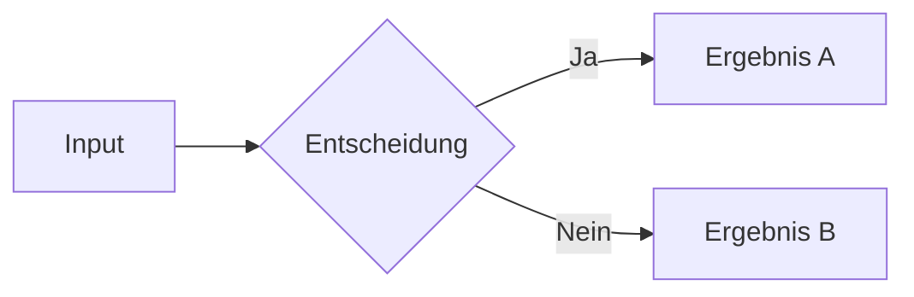

# Brand Style Guide — LinkedIn Slides

> Dieses Dokument definiert den visuellen Standard für alle LinkedIn-Carousel-Slides.
> Jeder Post muss diesen Guide einhalten, um ein konsistentes Brand-Erlebnis zu schaffen.

---

## Farbpalette

### Primär

| Name | Hex | CSS Variable | Verwendung |
|------|-----|-------------|------------|
| **Sand 50** | `#FAF8F5` | `var(--color-bg)` | Slide-Hintergrund |
| **Sand 100** | `#F0EBE3` | `var(--color-surface)` | Card-Hintergrund, Surface |
| **Sand 200** | `#D4C5B0` | `var(--color-border)` | Borders, Trennlinien |
| **Sand 800** | `#2C2416` | `var(--color-text)` | Body-Text |
| **Sand 900** | `#1A1714` | `var(--color-heading)` | Headlines |

### Akzent

| Name | Hex | CSS Variable | Verwendung |
|------|-----|-------------|------------|
| **Copper** | `#C68B59` | `var(--color-accent)` | Akzentfarbe — Bold-Text, Zahlen, Marker, CTAs, Akzentlinie |

### Sekundär (sparsam einsetzen)

| Name | Hex | CSS Variable | Verwendung |
|------|-----|-------------|------------|
| **Sand 600** | `#6B5436` | `var(--color-muted)` | Muted Text — Subtitles, Beschreibungen |
| **Sand 300** | `#B8A48E` | — | Sehr dezenter Text — Hashtags, Fußzeilen |

### Regeln

- **Nie mehr als 3 Farben pro Slide** (Hintergrund + Text + Akzent)
- **Copper nur für Akzente** — niemals als Hintergrund oder Fließtext
- **Kein reines Schwarz** (`#000`) oder reines Weiß (`#FFF`) verwenden
- **Kontrast sicherstellen** — Text auf Sand-50-Hintergrund muss lesbar sein
- **Immer CSS-Variablen verwenden** — niemals Hex-Codes direkt in Slides

---

## Typografie

### Schriften

| Schrift | Gewichte | Verwendung |
|---------|----------|------------|
| **Playfair Display** | 400, 700 | Headlines (h1) — Serif für Eleganz und Autorität |
| **DM Sans** | 300–700 | Body, Listen, UI-Elemente — Clean und modern |
| **JetBrains Mono** | 400, 600 | Code-Snippets — Nur bei technischen Inhalten |

### Größen (bezogen auf 1080x1080 Canvas)

| Element | Größe | Gewicht |
|---------|-------|---------|
| **Cover-Headline** | 3.6rem | 700 (Bold) |
| **Slide-Headline** | 3rem | 700 (Bold) |
| **Statement (center)** | 2.6rem | 700 (Bold) |
| **Body-Text** | 1.4rem | 400 (Regular) |
| **Card-Title** | 1.25rem | 600 (Semibold) |
| **Card-Description** | 1.125rem | 400 (Regular) |
| **Große Zahlen** | 3.75rem | 700 (Bold), Serif |
| **Muted/Beschreibung** | 1.5rem | 400 (Regular) |

### Regeln

- **Headlines immer Playfair Display** (Serif) — das ist das Brand-Erkennungsmerkmal
- **Letter-spacing auf Headlines**: `-0.03em` (tight)
- **Line-height auf Headlines**: `1.1–1.15`
- **Body-Text immer DM Sans** — niemals Serif für Fließtext
- **Keine ALL-CAPS** — passt nicht zur Tonalität

---

## Layout

### Grundregeln

- **Aspect Ratio**: 1:1 (1080 x 1080px) — Standard für LinkedIn-Carousels
- **Padding**: 4.5rem (72px) auf allen Seiten
- **Vertikale Zentrierung**: Content ist immer vertikal zentriert (nicht oben angeheftet)
- **Akzentlinie**: Dezenter Copper-Gradient oben auf jeder Slide (3px)

### Slide-Typen

#### 1. Cover (Erste Slide)
- Headline: bottom-aligned
- Subtitle: muted color
- **Immer die stärkste Aussage** — muss zum Swipe motivieren

#### 2. Content (Standard)
- Headline + Body/Liste
- Vertikal zentriert
- Max. 5-6 Zeilen Content (weniger = besser)

#### 3. Cards
- Verwende `<Card>` und `<CardGrid>` Komponenten (siehe Komponenten-Sektion)
- Card-Titel in Copper, Beschreibung in Sand 600

#### 4. Zahlen/Stats
- Verwende `<Stat>` Komponente (siehe Komponenten-Sektion)
- Große Zahl: Serif (Playfair Display), Copper
- Beschreibung: Sand 600

#### 5. Center/Statement
- Text zentriert
- Headline max. 90% Breite
- Subtitle/Body in muted color
- **Für Key Takeaways und starke Aussagen**

#### 6. End (Letzte Slide)
- Name + kurze Bio
- CTA in Copper
- Hashtags in Sand 300
- Copper-Linie am unteren Rand (statt oberer Akzentlinie)
- **Immer mit Follow-CTA**

### Whitespace

- **Whitespace ist ein Feature, kein Bug** — lieber weniger Content als vollgestopft
- **Max. 6-7 Elemente pro Slide** (Headline + 5 Items)
- **Mindestens 30% der Slide sollte leer sein**

---

## Komponenten

### Card

Für Step-by-Step-Listen, Feature-Listen, Konzepte:

```html
<Card title="Titel" description="Beschreibung" />
```

Mit eigenem Content im Slot:

```html
<Card title="Titel">
  <p>Beliebiger Content im Slot</p>
</Card>
```

### CardGrid

Wrapper für mehrere Cards. `cols` kontrolliert das Layout (1 oder 2 Spalten):

```html
<CardGrid :cols="2">
  <Card title="Erster Punkt" description="Beschreibung" />
  <Card title="Zweiter Punkt" description="Beschreibung" />
</CardGrid>
```

### Stat

Für Zahlen und Metriken:

```html
<Stat value="42" label="Projekte gebaut" />
```

### IconText

Für Tool-Listen, Stack-Übersichten:

```html
<IconText icon="🔧" title="Tool Name" description="Was es tut" />
```

---

## MDC Inline-Syntax

MDC (Markdown Components) erlaubt Inline-Styling direkt im Markdown. Aktiviert über `mdc: true` im Headmatter.

### Syntax

```markdown
[hervorgehobener Text]{style="color: var(--color-accent)"}
```

### Regeln

- **Nur für einzelne Wörter oder kurze Phrasen** — nicht für ganze Absätze
- **Immer CSS-Variablen verwenden** — niemals Hex-Codes
- **Sparsam einsetzen** — max. 1-2 pro Slide, sonst wird es unruhig
- **Bevorzuge Markdown `**bold**`** — MDC nur wenn Bold nicht ausreicht

### Beispiele

```markdown
Das ist ein [wichtiger Punkt]{style="color: var(--color-accent); font-weight: 600"} im Text.

Ergebnis: [+340%]{style="color: var(--color-accent); font-family: var(--font-serif); font-size: 1.8rem"}
```

---

## Handgezeichnete Annotationen (v-mark)

v-mark erzeugt Rough-Notation-Annotationen (Unterstreichungen, Kreise, Hervorhebungen) die aussehen wie handgezeichnet. Perfekt für Betonung auf LinkedIn-Slides.

### Syntax

```markdown
Wir haben das <v-mark color="var(--color-accent)" type="underline" at="true">komplett neu gedacht.</v-mark>
```

### Typen

| Type | Effekt | Gut für |
|------|--------|---------|
| `underline` | Unterstreichung | Einzelne Wörter betonen |
| `circle` | Einkreisen | Zahlen, Schlüsselbegriffe |
| `highlight` | Hintergrund-Marker | Kurze Phrasen hervorheben |
| `strike-through` | Durchgestrichen | Vorher/Nachher-Vergleiche |
| `bracket` | Klammer | Randbemerkungen |

### Regeln

- **Immer Copper als Farbe** — `color="var(--color-accent)"`
- **Max. 1-2 pro Slide** — sonst verliert der Effekt seine Wirkung
- **`at="true"` für statische Exports** — ohne `at` wird die Animation nur im Dev-Modus sichtbar, nicht im PDF/PNG-Export
- **Kurze Texte** — v-mark wirkt am besten auf 1-3 Wörter

---

## Mermaid-Diagramme

### Wann einsetzen

- **Flowcharts** für Prozesse, Entscheidungsbäume, Workflows
- **Sequence Diagrams** für API-Flows, Interaktionen zwischen Systemen
- **Mindmaps** für Konzept-Übersichten

### Regeln

- **Max. 1 Diagramm pro Slide** — Diagramm IST der Content
- **Wenige Nodes** — max. 6-8 Nodes, sonst wird es auf 1080x1080 unleserlich
- **Kurze Labels** — 2-3 Worte pro Node, keine Sätze
- **Kein zusätzliches Styling nötig** — `setup/mermaid.ts` wendet Brand-Farben automatisch an
- **Layout `center` bevorzugen** — Diagramme wirken besser zentriert

### Syntax in Slides

~~~markdown
---
layout: center
---

# Headline über dem Diagramm


~~~

### Diagramm-Typen für LinkedIn

| Typ | Syntax | Gut für |
|-----|--------|---------|
| Flowchart | `graph LR` / `graph TD` | Prozesse, Workflows |
| Sequence | `sequenceDiagram` | API-Calls, Interaktionen |
| Mindmap | `mindmap` | Übersichten, Konzepte |
| Pie | `pie` | Verteilungen (sparsam) |

---

## Do's & Don'ts

### Do's

- Konsistente Farbpalette über alle Slides
- Playfair Display für Headlines, DM Sans für Body
- Copper-Akzent sparsam aber gezielt einsetzen
- Viel Whitespace lassen
- Jede Slide hat genau EINE Kernaussage
- Cover-Slide muss zum Swipe motivieren
- End-Slide mit klarem CTA
- CSS-Variablen statt Hex-Codes in Slides verwenden
- Vue-Komponenten (`<Card>`, `<Stat>`, `<IconText>`) statt rohem HTML

### Don'ts

- Kein reines Schwarz oder Weiß
- Keine Stockfotos oder generischen Illustrationen
- Keine Gradients auf Text
- Keine Schatten auf Cards (Borders reichen)
- Keine verschiedenen Akzentfarben pro Post — immer Copper
- Nicht mehr als 2 Schriften pro Slide (Serif + Sans)
- Keine überfüllten Slides — lieber eine Slide mehr
- Keine `<style>`-Blöcke in Slide-Dateien — alles liegt in `styles/`
- Keine Hex-Codes direkt in Slides — CSS-Variablen verwenden

---

## Slide-Anzahl

| Post-Typ | Empfohlene Slides |
|-----------|-------------------|
| Build Log | 6-8 |
| Deep-Dive | 8-10 |
| Honest Take | 5-7 |
| Before/After | 6-8 |
| Tool Review | 7-9 |

**Regel**: Cover + Content-Slides + Takeaway + End = Gesamt
**Max**: 10 Slides (LinkedIn-Limit: 20, aber kürzer = besser)

---

## Qualitätscheck (vor Export)

Vor dem Export muss jede Slide visuell geprüft werden:

- [ ] Hintergrundfarbe ist Sand 50 (`#FAF8F5`)
- [ ] Headlines in Playfair Display (Serif)
- [ ] Body in DM Sans
- [ ] Copper-Akzent nur auf Bold/Zahlen/Marker
- [ ] Content vertikal zentriert
- [ ] Akzentlinie oben sichtbar (außer End-Slide)
- [ ] Keine Textüberlappung oder Overflow
- [ ] Genug Whitespace (≥30% leer)
- [ ] End-Slide hat Follow-CTA
- [ ] Lesbar auf Mobile (Schrift groß genug)
- [ ] Keine Hex-Codes in Slide-Dateien (nur CSS-Variablen)
- [ ] v-mark Annotationen haben `at="true"` für Export

---

*Letzte Aktualisierung: 2026-02-22*
