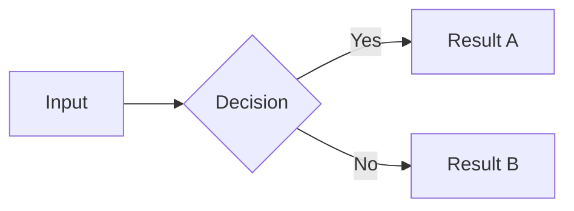

<div align="center">

# linkedin-carousel-kit

**Markdown to LinkedIn carousel slides.**
Write your content, get a polished PDF carousel.

Built with [Slidev](https://sli.dev) and a warm, professional design system
inspired by earthy tones and clean typography.

[](LICENSE)
[](https://github.com/mulkatz/linkedin-carousel-kit/releases)
[](https://sli.dev)

</div>

---

## What you get

- **1:1 aspect ratio** (1080x1080) optimized for LinkedIn carousels
- **Design system** with Playfair Display headlines, DM Sans body text, and copper accents
- **Pre-built slide types** — Cover, Content, Cards, Stats, Center/Statement, End/CTA
- **Mermaid diagrams** — natively supported, automatically branded
- **One command** to export as PDF carousel

## Quick start

```bash
git clone https://github.com/mulkatz/linkedin-carousel-kit.git
cd linkedin-carousel-kit
npm install
```

Edit `slides.md` with your content, then:

```bash
# Preview in browser
npm run dev

# Export as PDF carousel
npm run export
```

Upload the generated `carousel.pdf` to LinkedIn as a document post.

## Writing slides

Each slide is separated by `---` in the markdown file. Use frontmatter for slide-level config:

```markdown
---
layout: center
---

# Your centered statement here.

With a **bold accent** on the key point.
```

### Available layouts

| Layout | Use for |
|--------|---------|
| `cover` | First slide — big headline, bottom-aligned |
| *(default)* | Standard content — headline + body/list |
| `center` | Key takeaways, strong statements |
| `end` | Last slide — name, bio, CTA |

### Mermaid diagrams

Mermaid diagrams are supported natively and automatically styled to match the brand. Just use a `mermaid` code block:

````markdown
---
layout: center
---

# Process Overview


````

Supported diagram types: flowcharts, sequence diagrams, mindmaps, pie charts. See [BRAND-STYLE-GUIDE.md](./BRAND-STYLE-GUIDE.md#mermaid-diagramme) for guidelines.

### Components

**Cards** for step-by-step or feature lists:

```html
<div class="bg-[#F0EBE3] rounded-xl p-6 border border-[#D4C5B0]">
  <div class="text-[#C68B59] font-semibold text-xl mb-1">Card Title</div>
  <div class="text-[#6B5436] text-lg">Card description here</div>
</div>
```

**Stats** for numbers that pop:

```html
<div class="flex items-baseline gap-5">
  <span class="font-serif font-bold text-6xl text-[#C68B59]">42</span>
  <span class="text-[#6B5436] text-2xl">things accomplished</span>
</div>
```

**Icon + Text** for tool/stack lists:

```html
<div class="flex items-center gap-5">
  <span class="text-4xl">🔧</span>
  <div>
    <span class="font-semibold text-xl">Tool Name</span>
    <span class="text-[#6B5436] text-lg">— What it does</span>
  </div>
</div>
```

## Design system

### Colors

| Name | Hex | Role |
|------|-----|------|
| Sand 50 | `#FAF8F5` | Slide background |
| Sand 100 | `#F0EBE3` | Card background |
| Sand 200 | `#D4C5B0` | Borders |
| Sand 800 | `#2C2416` | Body text |
| Sand 900 | `#1A1714` | Headlines |
| Copper | `#C68B59` | Accent — bold text, numbers, CTAs |

### Typography

| Font | Role |
|------|------|
| **Playfair Display** | Headlines (serif, elegant) |
| **DM Sans** | Body text, UI (clean, modern) |
| **JetBrains Mono** | Code snippets |

### Rules

- Max 3 colors per slide (background + text + accent)
- Copper for accents only — never as background or body text
- No pure black (`#000`) or pure white (`#FFF`)
- Headlines always Playfair Display (serif)
- Body always DM Sans (sans-serif)
- At least 30% whitespace per slide

See [BRAND-STYLE-GUIDE.md](./BRAND-STYLE-GUIDE.md) for the full specification.

## Customizing

### Change the accent color

Edit the `copper` value in `uno.config.ts` and update the hex codes in the `<style>` block of your `slides.md`.

### Change fonts

Update the Google Fonts link in `index.html` and the font families in `uno.config.ts` and the `<style>` block.

### Add new slide types

Create Vue components in `layouts/` following the [Slidev custom layouts](https://sli.dev/guide/custom-layouts) documentation.

## Project structure

```
linkedin-carousel-kit/
├── slides.md              <- Your slide content (edit this)
├── template.md            <- Slide template for new posts
├── index.html             <- Google Fonts loading
├── uno.config.ts          <- UnoCSS theme (colors, fonts, shortcuts)
├── setup/mermaid.ts       <- Mermaid brand theming (auto-loaded by Slidev)
├── styles/                <- Base CSS (variables, typography, layouts)
├── components/            <- Custom Slidev components
├── layouts/               <- Custom Slidev layouts
├── public/                <- Static assets (images, etc.)
├── BRAND-STYLE-GUIDE.md   <- Full design specification
└── package.json
```

## Workflow

1. Write your post text first (clarity before design)
2. Break it into slides — one key point per slide
3. `npm run dev` — preview and iterate
4. Export: `npm run export` -> `carousel.pdf`
5. Upload PDF to LinkedIn as a document post

## Contributing

Contributions are welcome! Please see [CONTRIBUTING.md](CONTRIBUTING.md) for guidelines.

This project follows the [Contributor Covenant Code of Conduct](CODE_OF_CONDUCT.md).

## License

[MIT](LICENSE)
