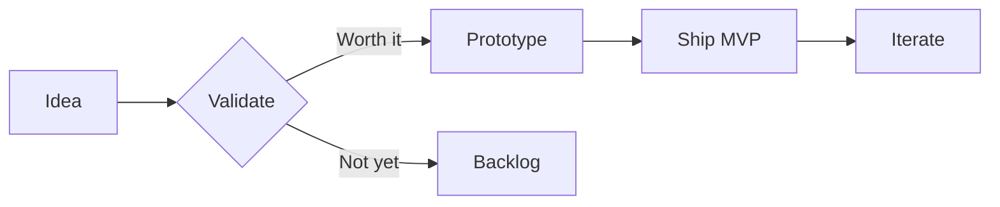
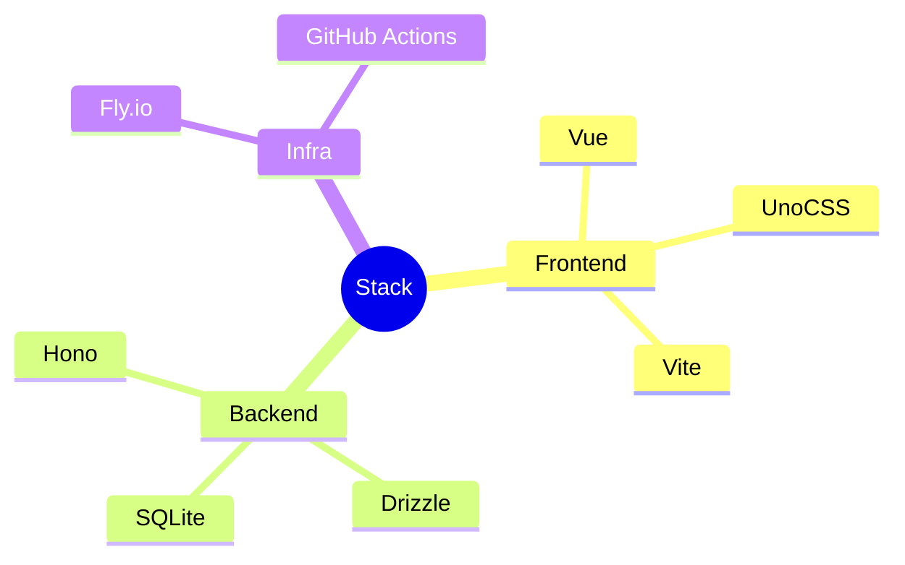

# The Architecture Nobody Talks About.

How I rebuilt my entire stack in a weekend.

---

# Why most devs get this wrong.

They start with the **framework** instead of the **problem.**

The best architecture is the one that disappears — you stop thinking about it and start building.

- Start with the user's pain point
- Pick the simplest tool that solves it
- Only add complexity when you **feel** the pain

---

# The three pillars.

<CardGrid :cols="1">
  <Card title="Clarity" description="Know what you're building before you touch code." />
  <Card title="Simplicity" description="Every abstraction has a cost. Pay it only when necessary." />
  <Card title="Speed" description="Ship fast, learn fast. Perfection is the enemy of progress." />
</CardGrid>

---

# Side by side.

<CardGrid :cols="2">
  <Card title="Before" description="Monolith with 47 dependencies, 3-minute build times, zero tests." />
  <Card title="After" description="Three services, 12 dependencies, 8-second builds, 94% coverage." />
  <Card title="Old Stack" description="Express + Mongoose + EJS + jQuery + Webpack + Babel" />
  <Card title="New Stack" description="Hono + Drizzle + Vue + Vite" />
</CardGrid>

---

# Card with slot content.

<Card title="Custom Content Example">
  
This card uses the <strong>slot</strong> instead of the description prop. You can put any content here — lists, code, whatever fits.

</Card>

---

# The numbers speak.

<Stat value="73%" label="less code after the rewrite" />

<Stat value="8s" label="build time (down from 180s)" />

<Stat value="14" label="days from idea to production" />

---

# My daily toolkit.

<IconText icon="⚡" title="Vite" description="Dev server and bundler" />
<IconText icon="🦕" title="Hono" description="Lightweight HTTP framework" />
<IconText icon="🗄️" title="Drizzle" description="Type-safe SQL that feels right" />
<IconText icon="🎨" title="UnoCSS" description="Atomic CSS, instant HMR" />

---

# This is [the key insight]{style="color: var(--color-accent); font-weight: 700"} that changed everything.

MDC inline syntax lets you highlight [specific words]{style="color: var(--color-accent)"} without breaking the flow.

---

# Blockquote and code test.

> Good architecture is not about picking the right framework. It's about making the wrong choice survivable.

Here's a small snippet: `const app = new Hono()` — clean and minimal.

---

# Mermaid flowchart.

---

# Mermaid mindmap.

---
layout: end
---

# Franz

Build less. Ship more. That's the whole philosophy.

Follow along for more.

#buildinpublic #webdev #architecture

