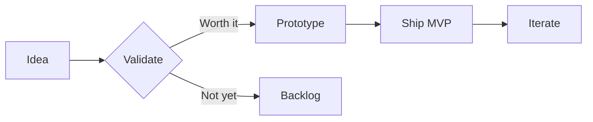
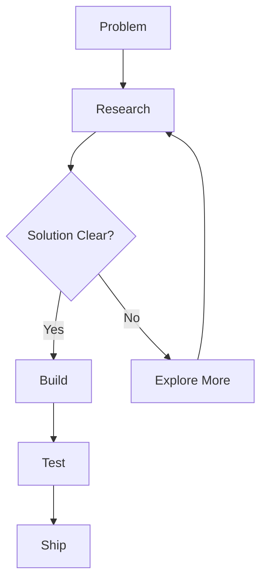
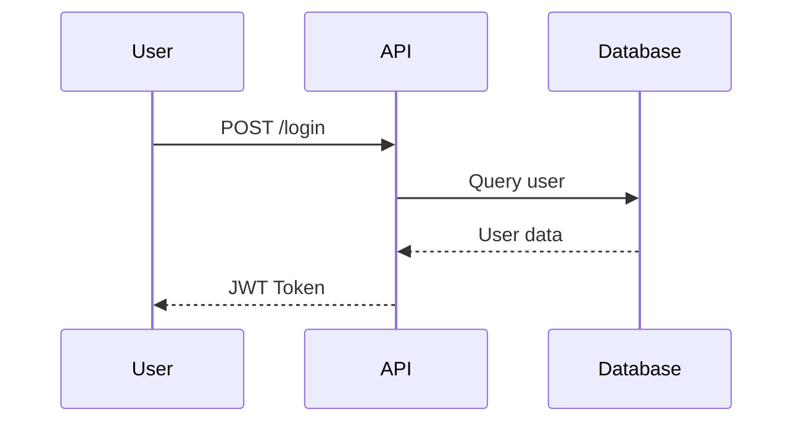
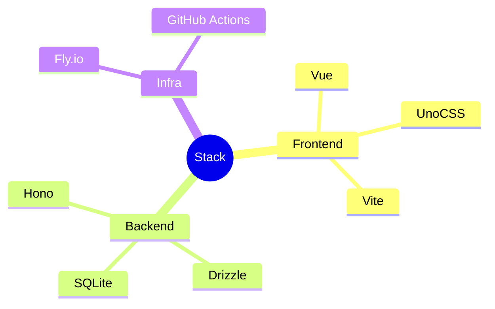
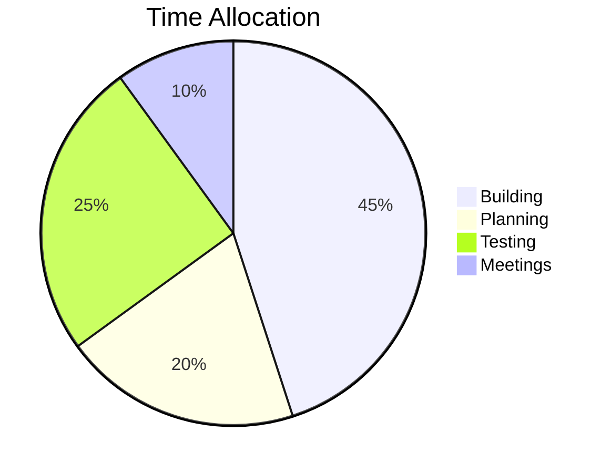

# Diagram Quality Test

Comparing diagrams against brand design system.

---

# Flowchart — Left to Right

---

# Flowchart — Top Down

---

# Sequence Diagram

---

# Mindmap

---

# Pie Chart

---

# Reference — Card Component

<CardGrid :cols="2">
  <Card title="Clarity" description="Know what you're building before you touch code." />
  <Card title="Speed" description="Ship fast, learn fast. Perfection is the enemy." />
</CardGrid>

---
layout: end
---

# Franz

Diagram quality test complete.

Follow along for more.

