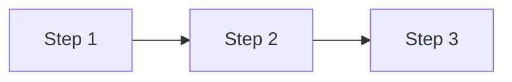

# [Cover-Headline — stärkste Aussage]

[Subtitle — kurz, muted]

---
layout: center
---

# [Content-Slide]

[Body-Text]

---
layout: center
---

<!-- Optional: Diagramm-Slide — nur wenn ein Prozess/Flow visualisiert werden soll -->

# [Diagramm-Headline]

---
layout: end
---

# Franz

[Takeaway oder abschließender Gedanke]

Follow along for more.

